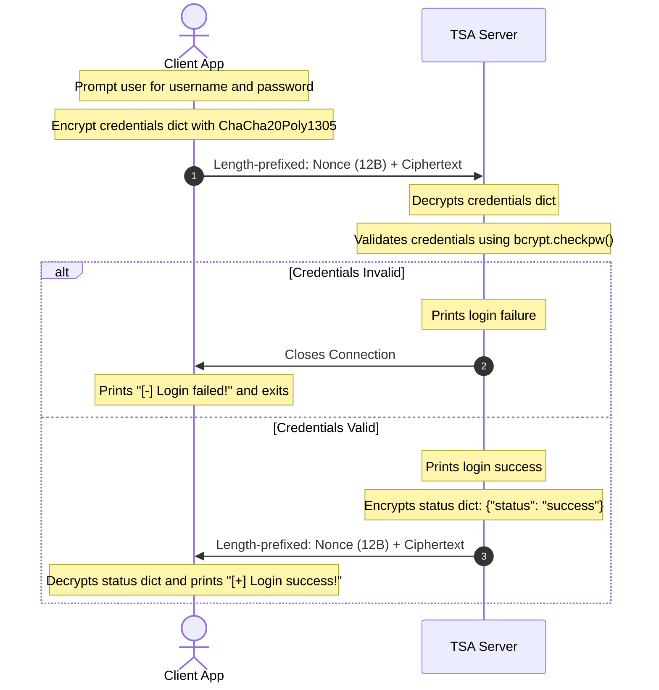
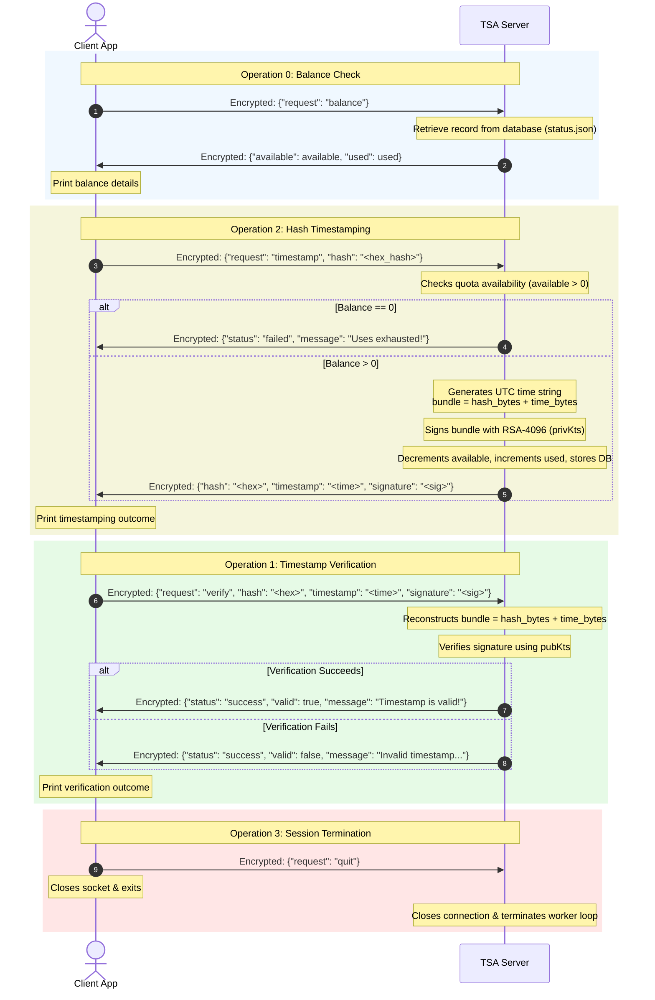

# Cryptographic Timestamping Service (TSS) Analysis and Design Report

This report analyzes the implementation of the Timestamping Service (TSS) provided in [Client.py](file:///C:/Didattica/Foundation_of_cybersecurity/Project/Client/Client.py) and [Server.py](file:///C:/Didattica/Foundation_of_cybersecurity/Project/Server/Server.py), describing its specifications, message formats, communication protocols, and testing scenarios.

---

## 1. Specifications and Design

### 1.1 Overview
The Timestamping Service (TSS) is a client-server application implementing a trusted third-party Time Stamping Authority (TSA). It allows registered users to submit cryptographic hashes of files/documents and receive back a cryptographically signed token binding the document's hash to a trusted timestamp. Users can subsequently verify these tokens to prove a document's existence at a specific time.

### 1.2 Architectural Components
1. **TSA Server ([Server.py](file:///C:/Didattica/Foundation_of_cybersecurity/Project/Server/Server.py))**: A TCP-based server listening on port `1488`. It handles connections, completes the secure handshake, validates credentials, tracks user token balances, issues timestamps, and verifies them.
2. **Client ([Client.py](file:///C:/Didattica/Foundation_of_cybersecurity/Project/Client/Client.py))**: A command-line client enabling users to connect to the server, authenticate, check their usage balance, request timestamps, and verify existing timestamps.
3. **Database Simulator ([Database.py](file:///C:/Didattica/Foundation_of_cybersecurity/Project/Server/Database.py))**: A persistent storage manager that manages registered users in a JSON file (`status.json`). It implements username/password authentication using `bcrypt` and handles usage counts (`available` and `used` timestamp quotas).

### 1.3 Cryptographic Design and Primitives
The service is built around solid cryptographic principles ensuring **Perfect Forward Secrecy (PFS)**, **authenticity**, **confidentiality**, and **integrity**.

* **Server Authentication**: 
  The server possesses a static RSA-4096 key pair: `(pubKts, privKts)`. The client pre-loads the public key [pubKts.pem](file:///C:/Didattica/Foundation_of_cybersecurity/Project/Server/TSA_Keys/pubKts.pem). During the handshake, the server signs its ephemeral public key using `privKts`, allowing the client to verify the server's identity and prevent Man-in-the-Middle (MitM) attacks.
* **Key Exchange (Perfect Forward Secrecy - PFS)**: 
  Established using ephemeral **X25519 (ECDH)** keys. Both client and server generate a new key pair for every session. Even if the server's long-term RSA private key is compromised in the future, past session traffic cannot be decrypted since the session keys are never transmitted and are derived from ephemeral parameters.
* **Key Derivation Function (KDF)**:
  Once the X25519 shared secret is computed, both parties derive a 32-byte symmetric session key using **HKDF-SHA256** with an info parameter of `b"session encryption"`.
* **Symmetric Session Encryption**:
  All exchange messages post-handshake are encrypted using **ChaCha20Poly1305** (an Authenticated Encryption with Associated Data - AEAD scheme). This protects the communication against eavesdropping and ensures message integrity/non-malleability.
* **Timestamp Signatures**:
  When a user requests a timestamp for a hash, the server binds the binary hash to the UTC timestamp string (`%Y-%m-%dT%H:%M:%SZ`) by signing the concatenated bundle `hash || timestamp_bytes` using the TSA's long-term RSA private key (`privKts`) with **RSA-PSS** padding, MGF1-SHA256, and SHA256.

---

## 2. Exchanged Message Formats

### 2.1 Communication Framing
After the initial handshake, all communication employs a structured length-prefixed protocol:
1. **Header**: 4 bytes, Big-Endian Unsigned Integer (`>I`), indicating the length of the payload in bytes.
2. **Payload**: The actual message bytes. For encrypted messages, the payload is structured as:
   * **Nonce**: 12 bytes (ChaCha20Poly1305 initialization vector).
   * **Ciphertext**: Variable bytes (the encrypted JSON string of the message).

---

### 2.2 Plaintext Handshake Messages
During the handshake, keys are exchanged in raw binary format without encryption or framing:

#### 1. Client Ephemeral Public Key (Client -> Server)
* **Size**: 32 bytes.
* **Format**: Raw X25519 public key bytes.

#### 2. Server Ephemeral Key + Signature (Server -> Client)
* **Size**: 544 bytes.
* **Format**: `server_pub_bytes` (32 bytes) concatenated with `signature` (512 bytes).
  * The signature is an RSA-4096 signature over the 32-byte `server_pub_bytes`.

#### 3. Handshake Confirmation (Server -> Client)
* **Format**: Length-prefixed message (4-byte header + 20-byte payload).
* **Payload**: `b"Handshake successful"` (ASCII).

---

### 2.3 Post-Handshake Encrypted Messages (JSON Schemes inside Ciphertext)

#### 1. Authentication (Login)
* **Request (Client -> Server)**:
  ```json
  {
    "username": "<username_string>",
    "password": "<password_string>"
  }
  ```
* **Response (Server -> Client)**:
  * *Success*:
    ```json
    {
      "status": "success"
    }
    ```
  * *Failure*: The server closes the socket connection immediately.

#### 2. Balance Check
* **Request (Client -> Server)**:
  ```json
  {
    "request": "balance"
  }
  ```
* **Response (Server -> Client)**:
  ```json
  {
    "available": <integer_remaining_tokens>,
    "used": <integer_consumed_tokens>
  }
  ```

#### 3. Hash Timestamping
* **Request (Client -> Server)**:
  ```json
  {
    "request": "timestamp",
    "hash": "<hex_encoded_document_hash>"
  }
  ```
* **Response (Server -> Client)**:
  * *Success*:
    ```json
    {
      "hash": "<hex_encoded_document_hash>",
      "timestamp": "<UTC_time_string_formatted_as_YYYY-MM-DDTHH:MM:SSZ>",
      "signature": "<hex_encoded_rsa_pss_signature>"
    }
    ```
  * *Failure (Quota Exhausted)*:
    ```json
    {
      "status": "failed",
      "message": "Uses exhausted!"
    }
    ```

#### 4. Timestamp Verification
* **Request (Client -> Server)**:
  ```json
  {
    "request": "verify",
    "hash": "<hex_encoded_document_hash>",
    "timestamp": "<UTC_time_string>",
    "signature": "<hex_encoded_rsa_pss_signature>"
  }
  ```
* **Response (Server -> Client)**:
  * *Valid Timestamp*:
    ```json
    {
      "status": "success",
      "valid": true,
      "message": "Timestamp is valid!"
    }
    ```
  * *Invalid / Manipulated Timestamp*:
    ```json
    {
      "status": "success",
      "valid": false,
      "message": "Invalid timestamp or altered data!"
    }
    ```

#### 5. Quit Request
* **Request (Client -> Server)**:
  ```json
  {
    "request": "quit"
  }
  ```
* **Response**: None (the socket is closed by both parties).

---

## 3. Communication Protocols & Sequence Diagrams

### Protocol 1: Connection & Cryptographic Handshake
Establishes the secure channel using ephemeral X25519 keys, verifies server authenticity using the pre-shared RSA public key, and derives a session key with PFS.

```mermaid
sequenceDiagram
    autonumber
    actor Client as Client App
    participant Server as TSA Server
    
    Note over Client, Server: TCP Connection Establishment
    Client->>Server: Connects to TCP Port 1488
    Server-->>Client: TCP Connection Accepted
    
    Note over Client, Server: Handshake & Cryptographic Setup
    Note over Client: Generates X25519 Ephemeral Key Pair<br/>(priv_kc_effimera, pub_kc_effimera)
    Client->>Server: Send pub_kc_effimera (Raw 32 bytes)
    
    Note over Server: Generates X25519 Ephemeral Key Pair<br/>(PrivKc, PubKc)
    Note over Server: Signs server's PubKc bytes using privKts (RSA-4096)
    Server->>Client: Send PubKc (32 bytes) + RSA Signature (512 bytes)
    
    Note over Client: Verifies signature using pubKts (RSA-4096)
    alt Verification Fails (Possible MitM Attack)
        Note over Client: Prints "MitM ATTACK DETECTED"
        Client->>Server: Closes Connection
    else Verification Succeeds (Server Authenticated)
        Note over Client: Prints "[SERVER AUTHENTICATED]"
        Note over Client: Computes Shared Secret (X25519)
        Note over Server: Computes Shared Secret (X25519)
        Note over Client, Server: Derives session_key via HKDF-SHA256
        Note over Client, Server: Instantiates ChaCha20Poly1305 Cipher
        Server->>Client: Length-prefixed confirmation payload: b"Handshake successful"
        Note over Client: Prints "[+] Server says: Handshake successful"
    end
```



---

### Protocol 2: Client Authentication (Login)
Validates the client's identity by sending credentials encrypted inside the newly established secure channel.



---

### Protocol 3: Session Operations (Balance, Timestamp, Verification, Quit)
Once authenticated, the client enters a command loop executing operations request-response sequentially.



---

## 4. Demonstration Scenarios (Exemplary Runs)

The following console walkthroughs illustrate the system behavior under three key testing scenarios:

### 4.1 Scenario A: Successful Timestamping
Using the account `Mattia` (who has 10 available timestamp tokens):

**Client Console Output:**
```text
[+] Connesso al server TSA su 127.0.0.1:1488
[+] Connessione stabilita con server
[>] Sending effimerate key to Server.
[+] [SERVER AUTHENTICATED]
[+] Canale sicuro stabilito (PFS abilitato).
[+] Server says: Handshake successful
Please insert your username:
Mattia
Please insert your password:
password123
[+] Login success!
Welcome! What do you want to do?
0 - See my balance.
1 - Verify timestamp.
2 - Timestamp an hash.
3 - Quit.
Send request n. 0
[+] Server replied with:
{
    "available": 10,
    "used": 0
}
Welcome! What do you want to do?
0 - See my balance.
1 - Verify timestamp.
2 - Timestamp an hash.
3 - Quit.
Send request n. 2
Inserisci l'hash del documento da firmare (in formato HEX): a1b2c3d4e5f67890a1b2c3d4e5f67890a1b2c3d4e5f67890a1b2c3d4e5f67890
Working on timestamping, please wait...
[+] Server replied with:
{
    "hash": "a1b2c3d4e5f67890a1b2c3d4e5f67890a1b2c3d4e5f67890a1b2c3d4e5f67890",
    "timestamp": "2026-06-21T14:45:30Z",
    "signature": "3c5f2b8a...[truncated 512 bytes hex signature]...09f2a"
}
Welcome! What do you want to do?
0 - See my balance.
1 - Verify timestamp.
2 - Timestamp an hash.
3 - Quit.
Send request n. 0
[+] Server replied with:
{
    "available": 9,
    "used": 1
}
Welcome! What do you want to do?
0 - See my balance.
1 - Verify timestamp.
2 - Timestamp an hash.
3 - Quit.
Send request n. 3
```

**Server Console Output:**
```text
[*] Server in ascolto su 127.0.0.1:1488...
[+] Connessione stabilita con ('127.0.0.1', 54890)
[<] Received client effimerate key.
[>] Effimerate + signature sent to client.
[+] Canale sicuro stabilito con successo (PFS abilitato).
[+] Handshake with ('127.0.0.1', 54890) successful
[+] Client credentials received: {'username': 'Mattia', 'password': 'password123'}
[+] Client credentials received: {'username': 'Mattia', 'password': 'password123'}
[+] Connessione or data invalid from ('127.0.0.1', 54890).
```

---

### 4.2 Scenario B: Unsuccessful Timestamping (Quota Exhausted)
Using the account `Isaia` (who has 0 available timestamp tokens left):

**Client Console Output:**
```text
[+] Connesso al server TSA su 127.0.0.1:1488
[+] Connessione stabilita con server
[>] Sending effimerate key to Server.
[+] [SERVER AUTHENTICATED]
[+] Canale sicuro stabilito (PFS abilitato).
[+] Server says: Handshake successful
Please insert your username:
Isaia
Please insert your password:
password123
[+] Login success!
Welcome! What do you want to do?
0 - See my balance.
1 - Verify timestamp.
2 - Timestamp an hash.
3 - Quit.
Send request n. 2
Inserisci l'hash del documento da firmare (in formato HEX): a1b2c3d4e5f67890a1b2c3d4e5f67890a1b2c3d4e5f67890a1b2c3d4e5f67890
Working on timestamping, please wait...
[+] Server replied with:
{
    "status": "failed",
    "message": "Uses exhausted!"
}
```

---

### 4.3 Scenario C: Verification of a Timestamp
Verifying the validity of the timestamp obtained in Scenario A:

**Client Console Output:**
```text
[+] Connesso al server TSA su 127.0.0.1:1488
[+] Connessione stabilita con server
[>] Sending effimerate key to Server.
[+] [SERVER AUTHENTICATED]
[+] Canale sicuro stabilito (PFS abilitato).
[+] Server says: Handshake successful
Please insert your username:
Mattia
Please insert your password:
password123
[+] Login success!
Welcome! What do you want to do?
0 - See my balance.
1 - Verify timestamp.
2 - Timestamp an hash.
3 - Quit.
Send request n. 1
Inserisci l'hash del documento (in formato HEX): a1b2c3d4e5f67890a1b2c3d4e5f67890a1b2c3d4e5f67890a1b2c3d4e5f67890
Inserisci il timestamp (es. 2026-06-21T14:45:30Z): 2026-06-21T14:45:30Z
Inserisci la firma (in formato HEX): 3c5f2b8a...[signature hex bytes]...09f2a
Working on verification, please wait...
[+] Server replied with:
{
    "status": "success",
    "valid": true,
    "message": "Timestamp is valid!"
}
```

**Server Console Output:**
```text
[+] Verifica riuscita: il timestamp è valido ed autentico.
```

**Verification of Altered Data (Failure Case):**
If a malicious user attempts to verify the same token but alters the timestamp string (e.g., changing the time from `14:45:30Z` to `14:45:00Z` to try and prove they signed it earlier):

**Client Console Output:**
```text
Send request n. 1
Inserisci l'hash del documento (in formato HEX): a1b2c3d4e5f67890a1b2c3d4e5f67890a1b2c3d4e5f67890a1b2c3d4e5f67890
Inserisci il timestamp (es. 2026-06-21T14:45:30Z): 2026-06-21T14:45:00Z
Inserisci la firma (in formato HEX): 3c5f2b8a...[signature hex bytes]...09f2a
Working on verification, please wait...
[+] Server replied with:
{
    "status": "success",
    "valid": false,
    "message": "Invalid timestamp or altered data!"
}
```

**Server Console Output:**
```text
[-] Verifica fallita: firma non valida o dati manipolati! (Invalid signature)
```
