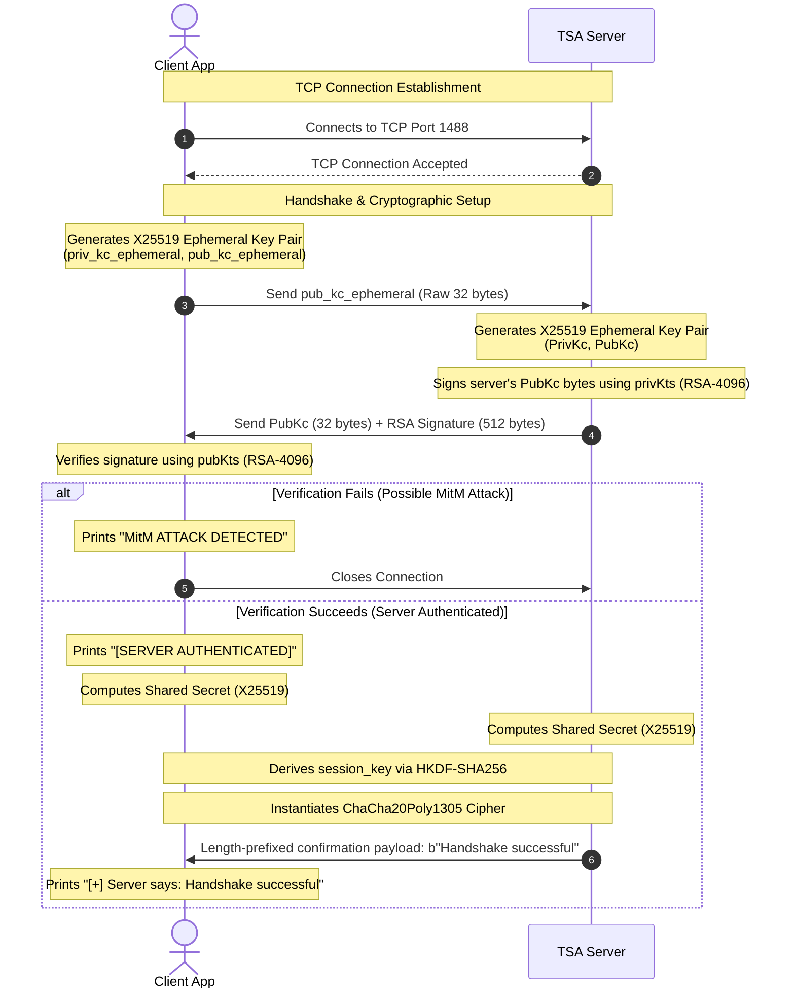
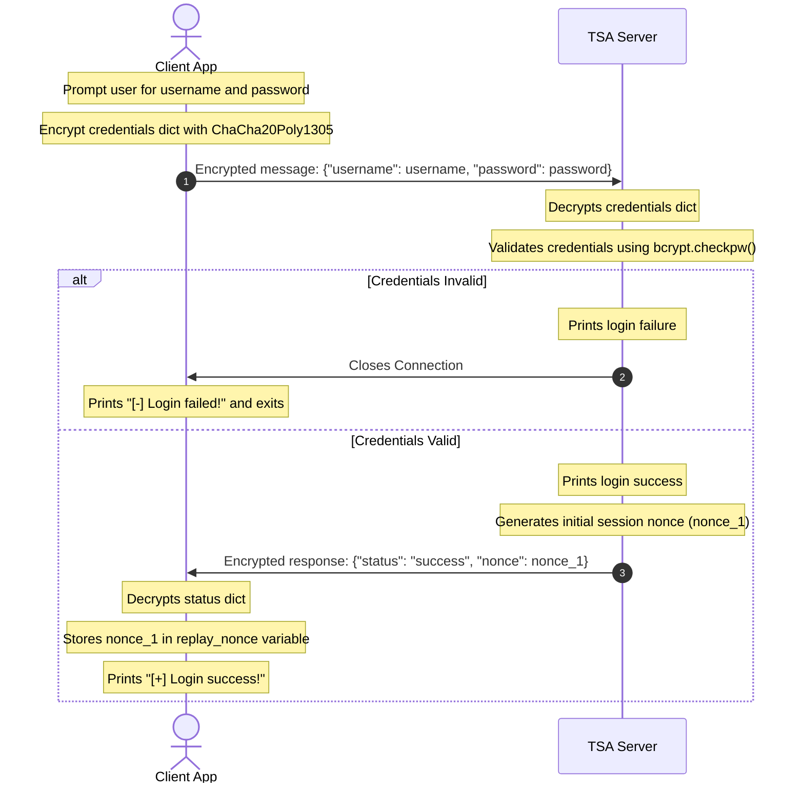
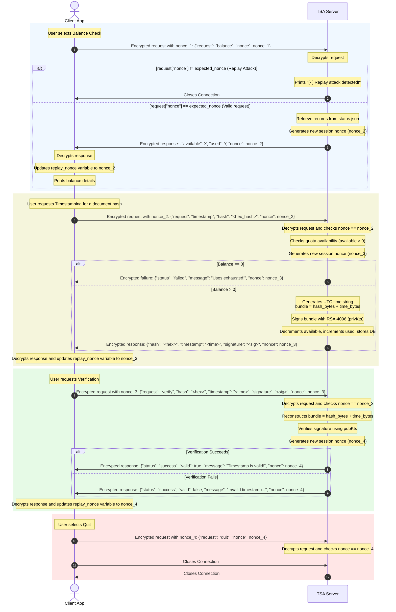

# Cryptographic Timestamping Service (TSS) Analysis and Design Report (V2 - Replay Attack Mitigation)

This updated report analyzes version 2 of the Timestamping Service (TSS) provided in [Client.py](file:///C:/Didattica/Foundation_of_cybersecurity/Project/Client/Client.py) and [Server.py](file:///C:/Didattica/Foundation_of_cybersecurity/Project/Server/Server.py). This version introduces a dynamic, server-driven nonce mechanism to prevent replay attacks within an active session.

---

## 1. Specifications and Design

### 1.1 Overview
The Timestamping Service (TSS) is a client-server application implementing a trusted third-party Time Stamping Authority (TSA). It allows registered users to submit cryptographic hashes of files/documents and receive back a cryptographically signed token binding the document's hash to a trusted timestamp. Users can subsequently verify these tokens to prove a document's existence at a specific time.

### 1.2 Architectural Components
1. **TSA Server ([Server.py](file:///C:/Didattica/Foundation_of_cybersecurity/Project/Server/Server.py))**: A TCP-based server listening on port `1488`. It handles connections, completes the secure handshake, validates credentials, tracks user token balances, issues timestamps, and verifies them.
2. **Client ([Client.py](file:///C:/Didattica/Foundation_of_cybersecurity/Project/Client/Client.py))**: A command-line client enabling users to connect to the server, authenticate, check their usage balance, request timestamps, and verify existing timestamps.
3. **Database Simulator ([Database.py](file:///C:/Didattica/Foundation_of_cybersecurity/Project/Server/Database.py))**: A persistent storage manager that manages registered users in a JSON file (`status.json`). It implements username/password authentication using `bcrypt` and handles usage counts (`available` and `used` timestamp quotas).

### 1.3 Cryptographic Security Features
The service is built around solid cryptographic principles ensuring **Perfect Forward Secrecy (PFS)**, **authenticity**, **confidentiality**, and **integrity**.

* **Server Authentication**: 
  The server possesses a static RSA-4096 key pair: `(pubKts, privKts)`. The client pre-loads the public key [pubKts.pem](file:///C:/Didattica/Foundation_of_cybersecurity/Project/Server/TSA_Keys/pubKts.pem). During the handshake, the server signs its ephemeral public key using `privKts`, allowing the client to verify the server's identity and prevent Man-in-the-Middle (MitM) attacks.
* **Key Exchange (Perfect Forward Secrecy - PFS)**: 
  Established using ephemeral **X25519 (ECDH)** keys. Both client and server generate a new key pair for every session. Even if the server's long-term RSA private key is compromised in the future, past session traffic cannot be decrypted since the session keys are never transmitted and are derived from ephemeral parameters.
* **Key Derivation Function (KDF)**:
  Once the X25519 shared secret is computed, both parties derive a 32-byte symmetric session key using **HKDF-SHA256** with an info parameter of `b"session encryption"`.
* **Symmetric Session Encryption**:
  All exchange messages post-handshake are encrypted using **ChaCha20Poly1305** (an Authenticated Encryption with Associated Data - AEAD scheme). This protects the communication against eavesdropping and ensures message integrity/non-malleability.
* **Replay Attack Mitigation (Dynamic Nonce Challenge-Response)**:
  To prevent replay attacks (where an attacker intercepts and repeats encrypted command messages within the session), a dynamic nonce-based challenge-response mechanism is implemented:
  1. Upon successful login, the server generates a cryptographically secure random 12-byte hex nonce: [Server.py L254-256](file:///C:/Didattica/Foundation_of_cybersecurity/Project/Server/Server.py#L254-L256).
  2. The server returns this nonce to the client inside the login outcome JSON.
  3. For every subsequent request (balance, timestamp, verify, quit), the client must include the current nonce in the request payload: [Client.py L209-222](file:///C:/Didattica/Foundation_of_cybersecurity/Project/Client/Client.py#L209-L222).
  4. The server decrypts the payload and verifies that the request nonce matches the expected session nonce: [Server.py L280-283](file:///C:/Didattica/Foundation_of_cybersecurity/Project/Server/Server.py#L280-L283). If it does not, the server immediately drops the connection.
  5. If the nonce is valid, the server immediately generates a new 12-byte random hex nonce, invalidating the old one, and includes the new nonce in its response JSON, which the client stores for its next request.
* **Timestamp Signatures**:
  When a user requests a timestamp for a hash, the server binds the binary hash to the UTC timestamp string (`%Y-%m-%dT%H:%M:%SZ`) by signing the concatenated bundle `hash || timestamp_bytes` using the TSA's long-term RSA private key (`privKts`) with **RSA-PSS** padding, MGF1-SHA256, and SHA256.

---

## 2. Exchanged Message Formats

### 2.1 Communication Framing
After the initial handshake, all communication employs a structured length-prefixed protocol:
1. **Header**: 4 bytes, Big-Endian Unsigned Integer (`>I`), indicating the length of the payload in bytes.
2. **Payload**: The actual message bytes. For encrypted messages, the payload is structured as:
   * **Nonce**: 12 bytes (ChaCha20Poly1305 initialization vector).
   * **Ciphertext**: Variable bytes (the encrypted JSON string of the message).

---

### 2.2 Plaintext Handshake Messages
During the handshake, keys are exchanged in raw binary format without encryption or framing:

#### 1. Client Ephemeral Public Key (Client -> Server)
* **Size**: 32 bytes.
* **Format**: Raw X25519 public key bytes.

#### 2. Server Ephemeral Key + Signature (Server -> Client)
* **Size**: 544 bytes.
* **Format**: `server_pub_bytes` (32 bytes) concatenated with `signature` (512 bytes).
  * The signature is an RSA-4096 signature over the 32-byte `server_pub_bytes`.

#### 3. Handshake Confirmation (Server -> Client)
* **Format**: Length-prefixed message (4-byte header + 20-byte payload).
* **Payload**: `b"Handshake successful"` (ASCII).

---

### 2.3 Post-Handshake Encrypted Messages (JSON Schemes inside Ciphertext)

#### 1. Authentication (Login)
* **Request (Client -> Server)**:
  ```json
  {
    "username": "<username_string>",
    "password": "<password_string>"
  }
  ```
* **Response (Server -> Client)**:
  * *Success*: Includes the first replay-prevention nonce.
    ```json
    {
      "status": "success",
      "nonce": "<12_byte_hex_nonce>"
    }
    ```
  * *Failure*: The server closes the socket connection immediately.

#### 2. Balance Check
* **Request (Client -> Server)**:
  ```json
  {
    "request": "balance",
    "nonce": "<current_replay_nonce>"
  }
  ```
* **Response (Server -> Client)**:
  ```json
  {
    "available": <integer_remaining_tokens>,
    "used": <integer_consumed_tokens>,
    "nonce": "<new_rotated_replay_nonce>"
  }
  ```

#### 3. Hash Timestamping
* **Request (Client -> Server)**:
  ```json
  {
    "request": "timestamp",
    "hash": "<hex_encoded_document_hash>",
    "nonce": "<current_replay_nonce>"
  }
  ```
* **Response (Server -> Client)**:
  * *Success*:
    ```json
    {
      "hash": "<hex_encoded_document_hash>",
      "timestamp": "<UTC_time_string_formatted_as_YYYY-MM-DDTHH:MM:SSZ>",
      "signature": "<hex_encoded_rsa_pss_signature>",
      "nonce": "<new_rotated_replay_nonce>"
    }
    ```
  * *Failure (Quota Exhausted)*:
    ```json
    {
      "status": "failed",
      "message": "Uses exhausted!",
      "nonce": "<new_rotated_replay_nonce>"
    }
    ```

#### 4. Timestamp Verification
* **Request (Client -> Server)**:
  ```json
  {
    "request": "verify",
    "hash": "<hex_encoded_document_hash>",
    "timestamp": "<UTC_time_string>",
    "signature": "<hex_encoded_rsa_pss_signature>",
    "nonce": "<current_replay_nonce>"
  }
  ```
* **Response (Server -> Client)**:
  * *Valid Timestamp*:
    ```json
    {
      "status": "success",
      "valid": true,
      "message": "Timestamp is valid!",
      "nonce": "<new_rotated_replay_nonce>"
    }
    ```
  * *Invalid / Manipulated Timestamp*:
    ```json
    {
      "status": "success",
      "valid": false,
      "message": "Invalid timestamp or altered data!",
      "nonce": "<new_rotated_replay_nonce>"
    }
    ```

#### 5. Quit Request
* **Request (Client -> Server)**:
  ```json
  {
    "request": "quit",
    "nonce": "<current_replay_nonce>"
  }
  ```
* **Response**: None (the socket is closed by both parties).

---

## 3. Communication Protocols & Sequence Diagrams

### Protocol 1: Connection & Cryptographic Handshake
Establishes the secure channel using ephemeral X25519 keys, verifies server authenticity using the pre-shared RSA public key, and derives a session key with PFS.



---

### Protocol 2: Client Authentication (Login) & Nonce Initialization
Validates the client's identity and issues the initial session nonce.



---

### Protocol 3: Session Operations (Dynamic Nonce Challenge & Rotation)
For every subsequent transaction, the client submits the current nonce. The server validates it, rotates it, and returns the new nonce.



---

## 4. Demonstration Run Scenario (Dynamic Nonce Walkthrough)

The following walkthrough illustrates the system log trace showing how nonces are updated and verified:

### 4.1 Scenario A: Successful Session Flow (Login & Balance Check)
Using the account `Mattia`:

**Client Console Output:**
```text
[+] Connesso al server TSA su 127.0.0.1:1488
[+] Connessione stabilita con server
[>] Sending effimerate key to Server.
[+] [SERVER AUTHENTICATED]
[+] Canale sicuro stabilito (PFS abilitato).
[+] Server says: Handshake successful
Please insert your username:
Mattia
Please insert your password:
password123
[+] Login success!
Welcome! What do you want to do?
0 - See my balance.
1 - Verify timestamp.
2 - Timestamp an hash.
3 - Quit.
Send request n. 0
[+] Server replied with:
{
    "available": 10,
    "used": 0,
    "nonce": "a7c8e9f2d1b09384726c105e"
}
```

*Note: In the login response payload, the client received the initial nonce: `"nonce": "a7c8e9f2d1b09384726c105e"`. When the client chose Option `0`, the client sent this nonce to the server. The server validated it, rotated it, and replied with the new nonce `"a7c8e9f2d1b09384726c105e"`.*

---

### 4.2 Scenario B: Replay Attack Detection
Suppose an eavesdropper records the encrypted network packet of the balance request sent in Scenario A (which contains `nonce_1 = a7c8e9f2d1b09384726c105e`). If they replay this exact packet later:

**Server Console Output:**
```text
[*] Server in ascolto su 127.0.0.1:1488...
[+] Connessione stabilita con ('127.0.0.1', 54910)
[<] Received client effimerate key.
[>] Effimerate + signature sent to client.
[+] Canale sicuro stabilito con successo (PFS abilitato).
[+] Handshake with ('127.0.0.1', 54910) successful
[+] Client credentials received: {'username': 'Mattia', 'password': 'password123'}
[-] Replay attack detected!
```

*Explanation: The server expects the newly rotated session nonce `nonce_2`. When the replayed packet is processed, the decrypted JSON contains `nonce_1`. The check `if json_message.get("nonce") != nonce_replay:` triggers, printing `[-] Replay attack detected!` and the server immediately drops the TCP connection to mitigate the attack.*
