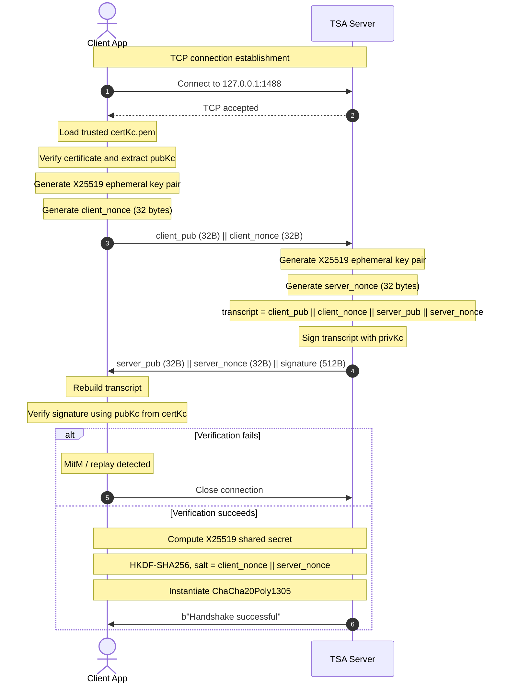
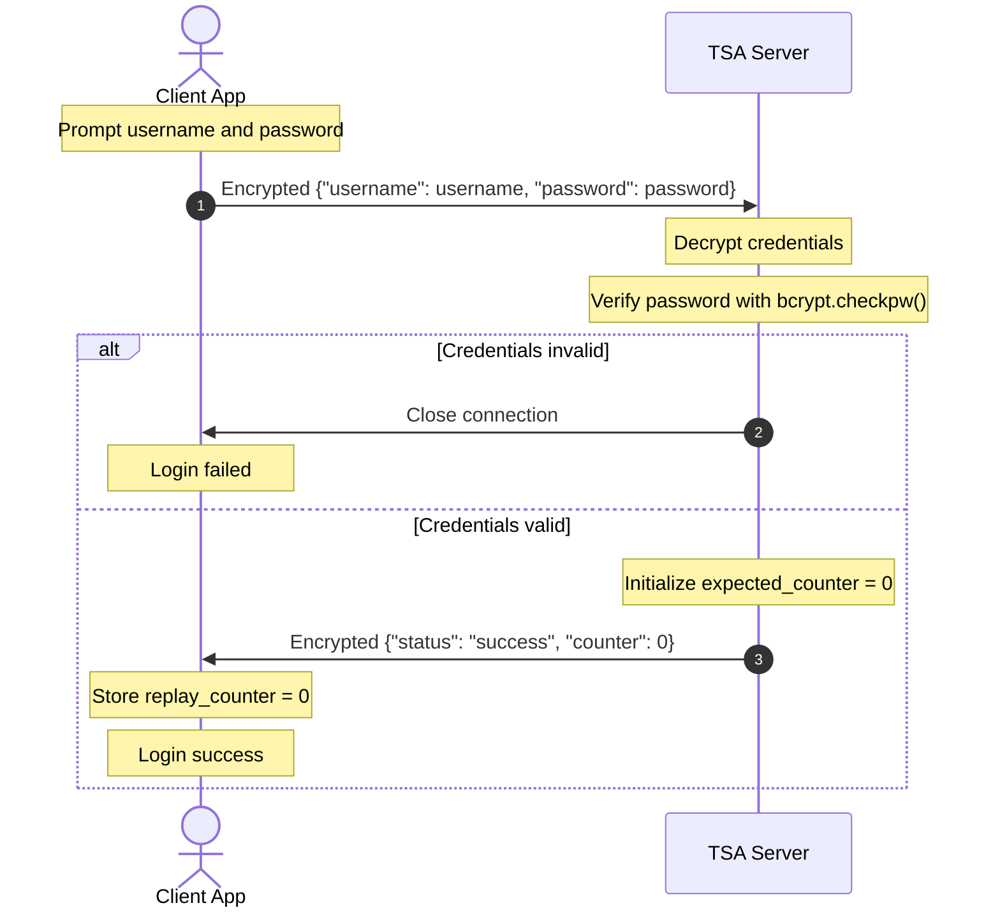
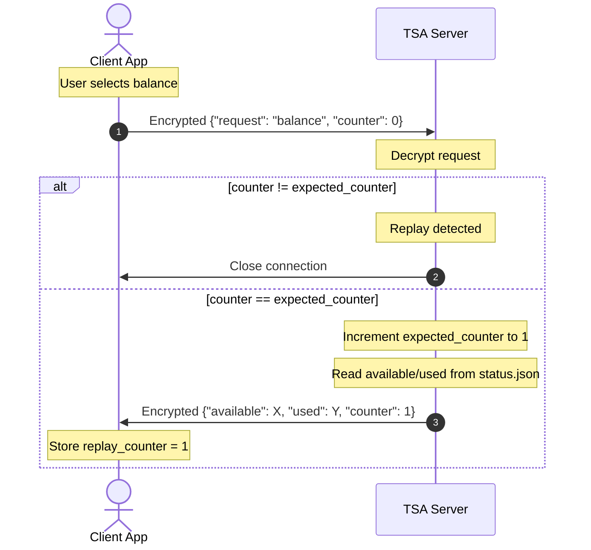
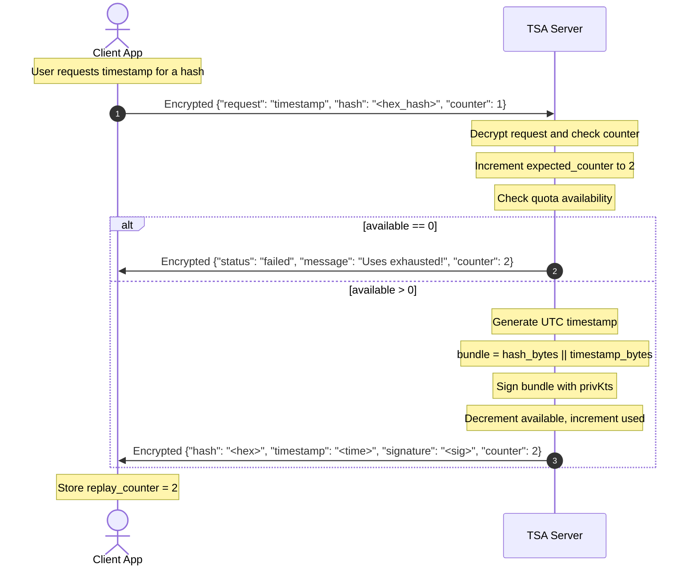
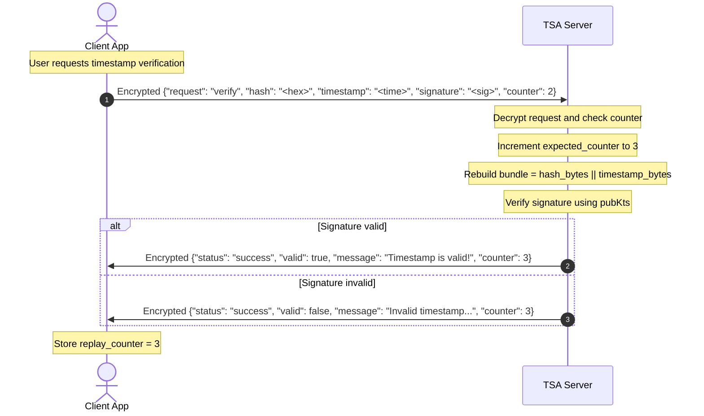
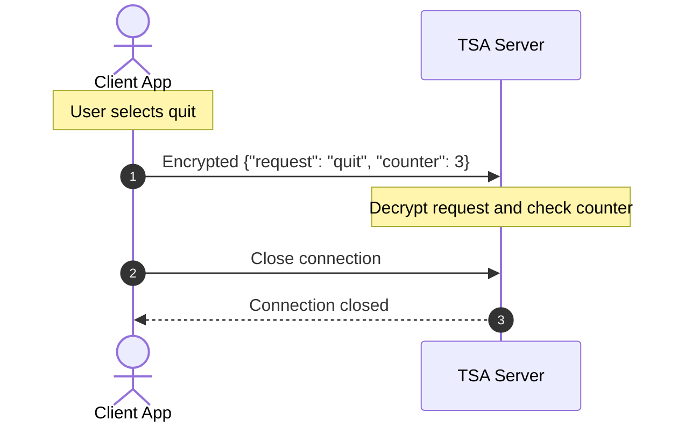

# Cryptographic Timestamping Service (TSS) Analysis and Design Report (V2 - Counter + PKI)

This report describes the updated Timestamping Service implementation. This version uses:

- a server certificate `certKc.pem` containing the connection-authentication public key `pubKc`;
- a transcript-bound X25519 handshake with Perfect Forward Secrecy;
- encrypted monotonic counters for replay protection after login;
- RSA-PSS timestamp signatures with `privKts`.

---

## 1. Specifications and Design

### 1.1 Overview

The Timestamping Service (TSS) is a client-server application implementing a trusted Time Stamping Authority (TSA). A registered user sends only the hash of a document, not the document itself. The server binds that hash to the current UTC time by signing:

```text
hash || timestamp
```

The returned timestamp token can later be verified using the TSA public signing key `pubKts`.

### 1.2 Architectural Components

1. **TSA Server (`Server/Server.py`)**: listens on `127.0.0.1:1488`, establishes the secure channel, authenticates users, tracks balances, signs timestamps, and verifies timestamp tokens.
2. **Client (`Client/Client.py`)**: command-line client used to log in, request balance, timestamp a hash, verify a timestamp, and quit.
3. **Database Simulator (`Server/Database.py`)**: JSON-backed user database storing bcrypt password hashes and timestamp quotas.
4. **Key Material (`Server/TSA_Keys/`)**:
   - `privKc.pem` / `certKc.pem`: server authentication key and certificate for the secure channel;
   - `privKts.pem` / `pubKts.pem`: timestamp-signing key pair.

### 1.3 Cryptographic Security Features

* **Server Authentication with Certificate**:
  The client loads the trusted server certificate `certKc.pem`, verifies it as its local trust anchor, extracts `pubKc`, and uses that public key to verify the server handshake signature. In this educational implementation, the certificate is self-signed and provisioned out-of-band.

* **Transcript-Bound Handshake**:
  Client and server exchange ephemeral X25519 public keys and 32-byte handshake nonces. The server signs the full transcript:

  ```text
  client_pub || client_nonce || server_pub || server_nonce
  ```

  This binds the server authentication to the exact handshake session.

* **Perfect Forward Secrecy**:
  Both parties derive the same X25519 shared secret from ephemeral keys. The session key is derived with HKDF-SHA256 using:

  ```text
  salt = client_nonce || server_nonce
  info = b"session encryption"
  ```

* **Authenticated Encryption**:
  After the handshake, all JSON messages are encrypted and authenticated with `ChaCha20Poly1305`. The 12-byte AEAD nonce is transmitted with the ciphertext, while the replay counter is inside the encrypted JSON payload.

* **Replay Protection with Counter**:
  After login, the server initializes an expected counter to `0`. Each client request must include the current counter inside the encrypted payload. If the counter is correct, the server increments it and returns the new value in its encrypted response. Replayed messages contain an old counter and are rejected.

* **Timestamp Signatures**:
  The server signs `hash || timestamp` with `privKts` using RSA-PSS and SHA-256. Verification uses `pubKts`.

---

## 2. Exchanged Message Formats

### 2.1 Communication Framing

After the initial handshake, messages are length-prefixed:

```text
4-byte big-endian payload length || payload
```

Encrypted payloads are:

```text
12-byte ChaCha20Poly1305 nonce || ciphertext_and_tag
```

The AEAD nonce is not the replay counter. The replay counter is encrypted inside the JSON payload.

### 2.2 Plaintext Handshake Messages

#### 1. Client Hello

```text
client_pub_bytes || client_nonce
32 bytes         || 32 bytes
```

Total size: `64` bytes.

#### 2. Server Hello

```text
server_pub_bytes || server_nonce || RSA-PSS signature
32 bytes         || 32 bytes     || 512 bytes
```

Total size: `576` bytes.

The signature is over:

```text
client_pub_bytes || client_nonce || server_pub_bytes || server_nonce
```

#### 3. Handshake Confirmation

Length-prefixed plaintext payload:

```text
b"Handshake successful"
```

### 2.3 Post-Handshake Encrypted JSON Messages

#### Login

Client to server:

```json
{
  "username": "<username_string>",
  "password": "<password_string>"
}
```

Server to client:

```json
{
  "status": "success",
  "counter": 0
}
```

#### Balance

Client to server:

```json
{
  "request": "balance",
  "counter": <current_counter>
}
```

Server to client:

```json
{
  "available": <integer_remaining_tokens>,
  "used": <integer_consumed_tokens>,
  "counter": <next_counter>
}
```

#### Timestamp

Client to server:

```json
{
  "request": "timestamp",
  "hash": "<hex_encoded_document_hash>",
  "counter": <current_counter>
}
```

Server to client, success:

```json
{
  "hash": "<hex_encoded_document_hash>",
  "timestamp": "<UTC_time_string>",
  "signature": "<hex_encoded_rsa_pss_signature>",
  "counter": <next_counter>
}
```

Server to client, exhausted quota:

```json
{
  "status": "failed",
  "message": "Uses exhausted!",
  "counter": <next_counter>
}
```

#### Verification

Client to server:

```json
{
  "request": "verify",
  "hash": "<hex_encoded_document_hash>",
  "timestamp": "<UTC_time_string>",
  "signature": "<hex_encoded_rsa_pss_signature>",
  "counter": <current_counter>
}
```

Server to client:

```json
{
  "status": "success",
  "valid": true,
  "message": "Timestamp is valid!",
  "counter": <next_counter>
}
```

or:

```json
{
  "status": "success",
  "valid": false,
  "message": "Invalid timestamp or altered data!",
  "counter": <next_counter>
}
```

#### Quit

Client to server:

```json
{
  "request": "quit",
  "counter": <current_counter>
}
```

The connection is closed after the request is accepted.

---

## 3. Communication Protocols and Mermaid Sources

The following Mermaid sources correspond to the PNG diagrams in `Report/Diagrams/`.

### 3.1 Handshake



### 3.2 Login and Counter Initialization



### 3.3 Balance



### 3.4 Timestamp



### 3.5 Verification



### 3.6 Quit



---

## 4. Demonstration Notes

A normal demo should show:

1. server startup;
2. client handshake with certificate-based server authentication;
3. login with an existing user, for example `Mattia / Mattia`;
4. balance request with counter `0`, response with counter `1`;
5. timestamp request with counter `1`, response with counter `2`;
6. verification request with counter `2`, response with counter `3`;
7. unsuccessful timestamping using an account with exhausted quota.

If an old encrypted request is replayed, the decrypted counter no longer matches the server's expected counter, so the server closes the connection.
